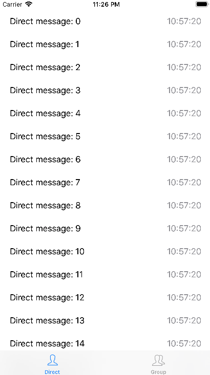

# MVVM-Swift
MVVM without overhead

It is demo project to show my lightweight solution for MVVM implementation.
Please check out my [personal blog](http://www.andrewturkin.com/swift/2018/3/14/mvvm-without-overhead) for description.

